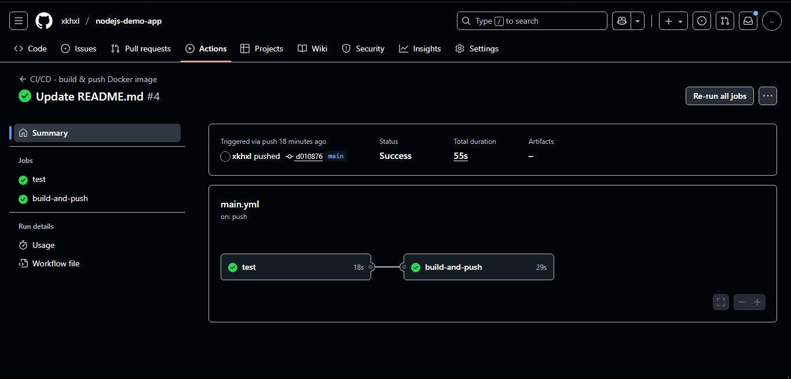
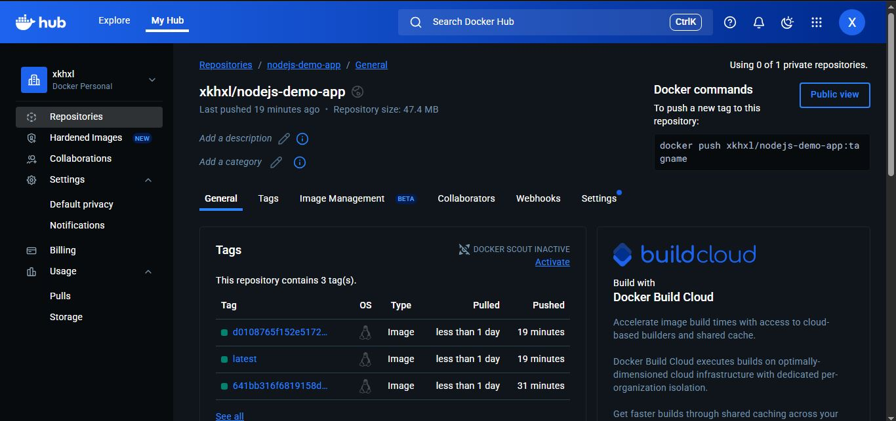

# Automate Code Deployment Using CI/CD Pipeline (GitHub Actions)

## Objective
To set up a CI/CD pipeline that automatically builds and deploys a Node.js web app using GitHub Actions and Docker.

---

## Workflow Overview
The pipeline is defined in `.github/workflows/main.yml`.

It performs the following automated steps:

1. **Trigger:** Runs whenever code is pushed to the `main` branch.
2. **Test Job:**
   - Checks out the repository.
   - Installs dependencies (`npm install`).
   - Runs a sample test script (`test.js`).
3. **Build & Push Job:**
   - Builds a Docker image using the `Dockerfile`.
   - Pushes the image to **DockerHub** using secrets (`DOCKERHUB_USERNAME`, `DOCKERHUB_TOKEN`).

---

## Testing the CI/CD Pipeline
1. Commit and push any change to `main`.
2. GitHub Actions runs automatically.
3. Verify results:
   - **Actions tab:** All jobs pass 
   - **DockerHub:** New image is uploaded 

---

## Screenshots

### 1. GitHub Actions Workflow

### 2. DockerHub Image

### 3. Running App (Play With Docker)

